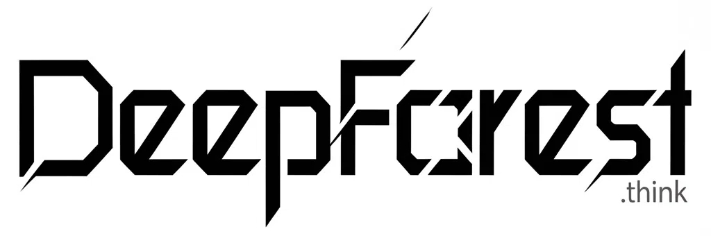
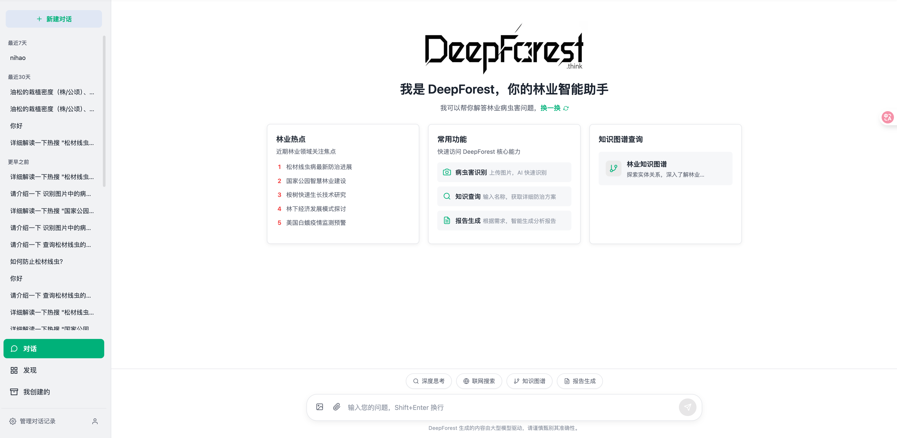
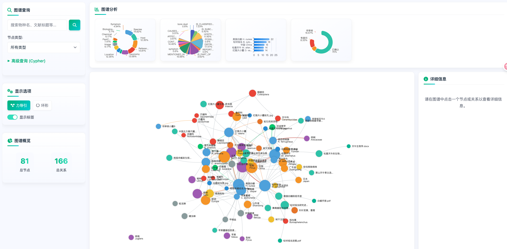
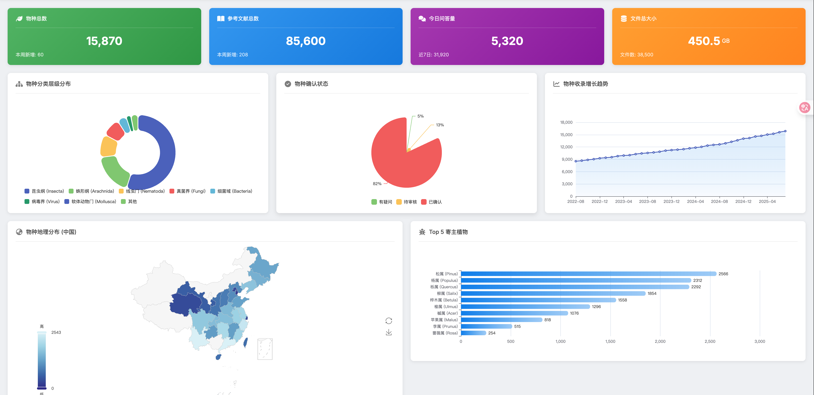
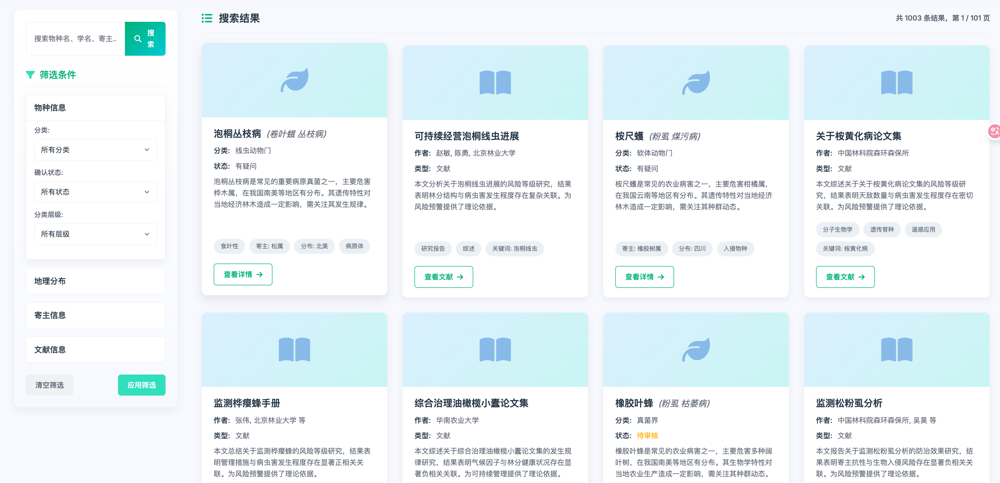

<p align="center">
    <a href="" target="_blank">
      
    </a>
</p>

<h1 align="center">DeepForest Frontend</h1>

<p align="center">
  <strong>基于 Next.js、React、火山引擎大模型、知识图谱与多源数据构建的智能林业后端服务。</strong>
  <br>
  为 DeepForest 前端应用提供强大的 API 支持，涵盖智能问答、数据分析、知识图谱和高级检索等核心功能。
</p>

<p align="center">
  
  
  
  
  
</p>

欢迎来到 **DeepForest** 前端项目！这是一个功能强大的林业病虫害智能问答与知识检索平台，利用先进的 AI 大模型、知识图谱（Knowledge Graph）和检索增强生成（RAG）技术，为林业研究人员、管理者和从业者提供前所未有的智能决策支持。

# 关联项目🔗
- DeepForest后端代码: https://github.com/Azure12355/deep-forest
- DeepForest爬虫代码: https://github.com/Azure12355/deep-forest-spider
## ✨ 核心功能

DeepForest 不仅仅是一个简单的查询工具，它是一个集成化的智能工作台，主要包含以下核心功能模块：

*   💬 **智能问答 (`/chat`)**: 与林业领域微调后的大模型进行多模态对话。您可以上传病虫害图片进行识别，或通过自然语言提问，获取精准的病虫害信息、发生规律及防治方案。

*   📊 **数据分析仪表盘 (`/analysis`)**: 以可视化的方式展示系统内的核心数据指标。通过丰富的图表（由 ECharts 驱动），直观了解物种收录、地理分布、文献增长等宏观态势。

*   🕸️ **知识图谱探索 (`/graph`)**: 项目的核心亮点！一个高度交互的可视化界面，您可以自由探索物种、寄主、文献、地理位置等实体之间的复杂关系，发现隐藏的知识和规律。

*   🔍 **结构化知识检索 (`/search`)**: 提供强大的多维度筛选功能，让您能快速、精确地从海量结构化数据中找到目标物种或文献信息，并查看其完整的详情页。

*   ✍️ **一体化数据录入 (`/entry`)**: 一个精心设计的结构化数据录入表单，支持动态添加多项关联信息（如寄主、分布地、图片、文献等），是构建整个知识库的基石。

## 📸 界面速览

<table>
  <tr>
    <td align="center"><b>智能问答</b></td>
    <td align="center"><b>知识图谱探索</b></td>
  </tr>
  <tr>
    <td></td>
    <td></td>
  </tr>
  <tr>
    <td align="center"><b>数据分析仪表盘</b></td>
    <td align="center"><b>知识检索与详情</b></td>
  </tr>
  <tr>
    <td></td>
    <td></td>
  </tr>
</table>

## 🛠️ 技术栈

本项目采用了一系列现代化技术栈，以实现高效、可维护和可扩展的前端应用。

*   **前端框架**: [Next.js](https://nextjs.org/) 15 (App Router), [React](https://react.dev/) 18
*   **编程语言**: [TypeScript](https://www.typescriptlang.org/)
*   **UI & 样式**:
    *   [Ant Design](https://ant.design/) (核心组件库)
    *   [Tailwind CSS](https://tailwindcss.com/) (原子化 CSS)
    *   [CSS Modules](https://github.com/css-modules/css-modules) (组件级样式隔离)
    *   [Font Awesome](https://fontawesome.com/) (图标库)
*   **数据可视化**: [ECharts](https://echarts.apache.org/en/index.html)
*   **API 通信**: [Axios](https://axios-http.com/) (统一请求实例), `fetch` API (用于 SSE 流式响应)
*   **Markdown 解析**: [React-Markdown](https://github.com/remarkjs/react-markdown) + [Remark-Gfm](https://github.com/remarkjs/remark-gfm)
*   **代码高亮**: [React-Syntax-Highlighter](https://github.com/react-syntax-highlighter/react-syntax-highlighter)
*   **包管理器**: [pnpm](https://pnpm.io/)
*   **部署**: [Docker](https://www.docker.com/), [Nginx](https://www.nginx.com/) (推荐生产环境), [Vercel](https://vercel.com/)

## 🚀 快速开始

请按照以下步骤在您的本地环境中运行本项目。

### 1. 先决条件

请确保您的开发环境中已安装以下软件：
*   [Node.js](https://nodejs.org/) (推荐 v18.x 或更高版本)
*   [pnpm](https://pnpm.io/installation) (推荐，当然也可以使用 `npm` 或 `yarn`)

### 2. 克隆与安装

```bash
# 1. 克隆项目到本地
git clone https://github.com/Azure12355/deep-forest.git

# 2. 进入项目目录
cd deep-forest-next-js

# 3. 使用 pnpm 安装依赖 (推荐)
pnpm install

# 或者使用 npm
# npm install

# 或者使用 yarn
# yarn install
```

### 3. 配置环境变量

项目需要一个后端 API 来提供数据。请根据您的后端地址配置环境变量。

首先，复制环境变量模板文件：
```bash
cp .env.development.example .env.development
```

然后，编辑新建的 `.env.development` 文件：
```
# .env.development
# 将此 URL 替换为您的本地后端 API 地址
NEXT_PUBLIC_API_BASE_URL=http://localhost:8101/api
```
> **💡 提示**:
> *   `.env.development` 用于开发环境 (`pnpm dev`)。
> *   `.env.production` 用于生产构建 (`pnpm build`)。其中 `NEXT_PUBLIC_API_BASE_URL=/api` 是一个相对路径，设计用于 Nginx 等反向代理环境。

### 4. 运行开发服务器

一切就绪！启动开发服务器：
```bash
pnpm dev
```
服务器启动后，在浏览器中打开 [http://localhost:3000](http://localhost:3000) 即可看到项目主页。

> ℹ️ 您可以通过访问 `/chat`, `/analysis`, `/graph`, `/search` 等路径来直接进入相应的功能模块。

### 5. 构建生产版本

当您准备部署时，可以构建项目的生产优化版本：
```bash
pnpm build
```
构建产物将生成在 `.next` 目录中。您可以使用 `pnpm start` 来启动生产服务器。

## 🚢 部署指南

我们推荐使用 Docker 进行容器化部署，这能提供一个一致且可靠的运行环境。

### 1. 使用 Docker (推荐)

项目根目录下已包含 `Dockerfile` 和 `.dockerignore` 文件。

**步骤:**

1.  **构建 Docker 镜像:**
    在项目根目录下运行以下命令，将 `your-image-name` 替换为您想要的镜像名称。
    ```bash
    docker build -t your-image-name .
    ```

2.  **运行 Docker 容器:**
    ```bash
    docker run -p 3000:3000 your-image-name
    ```
    这将在后台启动一个容器，并将容器的 3000 端口映射到您主机的 3000 端口。现在，您可以通过 `http://localhost:3000` 访问应用。

**Nginx 反向代理配置 (生产环境)**

在生产环境中，强烈建议使用 Nginx 作为反向代理来处理 HTTPS、负载均衡以及 API 转发。以下是一个示例配置，它将 `/api/` 的请求转发到后端服务，其他请求则由 Next.js 应用处理。

```nginx
server {
    listen 80;
    server_name your.domain.com; # 替换为您的域名

    # 可选：HTTP 自动跳转到 HTTPS
    # return 301 https://$host$request_uri;

    location / {
        # 转发到 Next.js 前端应用容器
        proxy_pass http://localhost:3000; # 假设前端容器运行在 3000 端口
        proxy_http_version 1.1;
        proxy_set_header Upgrade $http_upgrade;
        proxy_set_header Connection 'upgrade';
        proxy_set_header Host $host;
        proxy_cache_bypass $http_upgrade;
    }

    location /api/ {
        # 转发到后端 API 服务容器
        proxy_pass http://backend-service:8101/api/; # 替换为您的后端服务地址和端口
        proxy_set_header Host $host;
        proxy_set_header X-Real-IP $remote_addr;
        proxy_set_header X-Forwarded-For $proxy_add_x_forwarded_for;
        proxy_set_header X-Forwarded-Proto $scheme;
    }

    # ... 其他配置，如 SSL 证书 ...
}
```

### 2. 使用 Vercel

[Vercel](https://vercel.com/) 是 Next.js 的官方托管平台，部署非常简单。

1.  将您的项目推送到 GitHub/GitLab/Bitbucket 仓库。
2.  在 Vercel 上导入该仓库。
3.  在 Vercel 的项目设置中，添加环境变量 `NEXT_PUBLIC_API_BASE_URL` 并设置为您的 **生产环境后端 API 地址**。
4.  Vercel 将自动为您构建和部署应用。

## 📂 项目结构

项目代码主要位于 `src` 目录下，遵循功能模块化的组织方式。

```
src/
├── app/                  # Next.js App Router - 页面和路由
│   ├── analysis/         # 数据分析页面
│   ├── chat/             # 智能问答页面
│   ├── entry/            # 数据录入页面
│   ├── graph/            # 知识图谱页面
│   └── search/           # 知识检索页面 (包含动态详情页)
├── components/           # 全局共享组件 (如 Header)
├── analysis/             # 数据分析模块的相关组件和类型
├── chat/                 # 智能问答模块的相关组件和类型
├── entry/                # 数据录入模块的相关组件和类型
├── graph/                # 知识图谱模块的相关组件、Hook 和工具
├── search/               # 知识检索模块的相关组件和类型
├── lib/                  # 全局库和工具函数 (如 axios 实例, ECharts 配置)
├── services/             # API 调用层 (封装了所有与后端交互的函数)
└── styles/               # (如果需要) 全局样式或主题文件
```
> 此外，根目录下的 `home/` 和 `prototype/` 包含独立的静态页面和早期原型，它们不属于 Next.js 主应用的一部分，但为了解项目演进提供了参考。

## 🤝 贡献

我们非常欢迎社区的贡献！如果您有任何想法、建议或发现了 Bug，请随时提交 [Issues](https://github.com/Azure12355/deep-forest/issues)。

如果您想贡献代码，请遵循以下步骤：
1.  Fork 本仓库。
2.  创建一个新的分支 (`git checkout -b feature/your-amazing-feature`)。
3.  进行您的修改。
4.  提交您的更改 (`git commit -m 'Add some amazing feature'`)。
5.  将分支推送到您的 Fork (`git push origin feature/your-amazing-feature`)。
6.  创建一个新的 Pull Request。

## 📄 许可证

本项目采用 [MIT License](LICENSE) 授权。

---

希望这份文档能帮助您更好地理解和使用 DeepForest 项目！如有任何问题，欢迎随时提问。 Happy Coding! 🎉